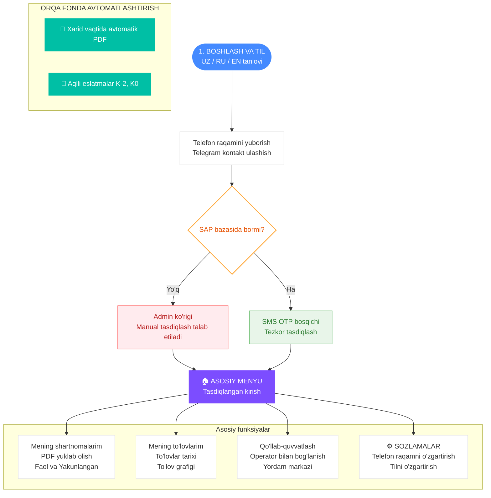

# Probox Telegram Bot Flowchart (Foydalanuvchi yo'li)

Ushbu diagramma **Probox Bot** uchun foydalanuvchi sayohati va tizim mantig'ining eng sodda va tushunarli ko'rinishini ifodalaydi.

## 📘 Oqim qisqacha mazmuni
1.  **Ro'yxatdan o'tish**: Foydalanuvchi tilni tanlaydi va telefon raqamini yuboradi.
2.  **Tasdiqlash**: 
    - Agar raqam **SAP tizimida** mavjud bo'lsa, foydalanuvchi darhol SMS OTP kodini oladi.
    - Agar yo'q bo'lsa, **Admin** so'rovni ko'rib chiqadi va qo'lda tasdiqlaydi.
3.  **Asosiy xizmatlar**: 
    - **Tasdiqlangan foydalanuvchilar**: Shartnomalarni ko'rishlari, PDF fayllarni yuklab olishlari va to'lovlar tarixini kuzatishlari mumkin.
4.  **Avtomatlashtirish**: Bot xarid amalga oshirilganda avtomatik ravishda shartnoma PDF faylini yuboradi va to'lov muddati kelishidan 2 kun oldin eslatma yuboradi.
